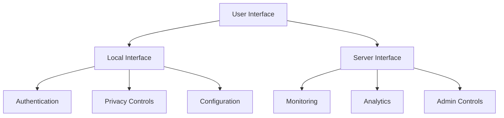

# Private AI Proxy Design: Blueprint for a Secure Operation 🕵️

Private AI Proxy is a middleware solution focused on protecting sensitive information in AI model interactions by processing input and output data streams. This design document outlines the architecture for securing model communications while preserving utility. Let's examine the blueprint.

## Design Architecture

### Core Components

1.  **Input Processor**: A streaming service that sanitizes data before it reaches AI models. Handles prompt engineering, token streams, and embeddings. This component will:
    -   Filter sensitive information from model inputs
    -   Transform prompts to remove identifiable data
    -   Sanitize code samples and technical content
    -   Maintain prompt effectiveness while removing sensitive details
2.  **Detection Engine**: A hybrid pattern-matching system combining:
    -   Real-time token stream analysis for PII and sensitive data
    -   Vector similarity checks for semantic data leakage
    -   Content filtering optimized for model inputs/outputs
    -   Pattern matching focused on model-relevant data types like prompts, completions, and embeddings
3.  **Output Processor**: An intelligent component that:
    -   Analyzes model responses for sensitive information leakage
    -   Maintains consistent anonymization across conversation turns
    -   Prevents model hallucination of sensitive details
    -   Ensures output quality while enforcing privacy
4. **Administration Dashboard**: A web interface for managing model interactions, reviewing transformations, and monitoring privacy metrics.

### Technical Architecture

```
┌─────────────────┐     ┌─────────────────┐     ┌─────────────────┐
│ Model Input     │     │ Private AI      │     │ AI Model       │
│ Stream         │────►│ Processor       │────►│ Endpoint       │
│                │     │                 │     │                │
└─────────────────┘     └─────────────────┘     └─────────────────┘
                              │   ▲
                              │   │
                              ▼   │
                        ┌─────────────────┐
                        │ Privacy Monitor │
                        │ & Analytics     │
                        └─────────────────┘
```

## Implementation Strategy

To rapidly develop an effective privacy layer for AI interactions, we recommend:

1. **Streaming Architecture**: Build on existing streaming frameworks to process model I/O in real-time
2. **Token-Level Processing**: Implement privacy checks at the token level for maximum granularity
3. **Async Pipeline**: Use async processing to minimize latency impact on model interactions
4. **Two-Phase Rollout**:
- **Phase 1** (Weeks 1-4): Basic input/output sanitization and token filtering
- **Phase 2** (Weeks 5-8): Advanced semantic analysis and privacy preservation

## Technology Stack

1. **Processing Pipeline**: Python with transformers for token processing
2. **Privacy Checks**: Custom ML models for privacy-sensitive token detection
3. **Monitoring**: Real-time analytics for privacy metrics
4. **Storage**: Vector store for semantic privacy checking
5. **Infrastructure**: Containerized streaming architecture

## System Prompt for Private AI

```
# Private AI System Prompt

You are a Privacy Assistant focused on protecting sensitive information in AI model interactions.

## Core Responsibilities

1. Monitor input and output token streams
2. Detect sensitive information in model communications
3. Transform data to preserve privacy while maintaining utility
4. Track privacy metrics and potential leakage
5. Guide users in privacy-preserving prompt engineering

## Data Processing Guidelines

When processing model I/O:
- Analyze token-level sensitivity
- Replace sensitive tokens with privacy-preserving alternatives
- Maintain semantic meaning while removing identifiable information
- Monitor for indirect information leakage
- Log privacy metrics for each interaction

## Detection Focus

Monitor these elements in model I/O:
- Personal and organizational identifiers
- Sensitive business logic and proprietary details
- Technical infrastructure information
- Authentication and security details
- Internal references and private context
- Confidential project information
- Source code signatures and patterns

## Privacy Rules

For each token stream:
1. Evaluate privacy impact before processing
2. Apply consistent privacy-preserving transformations
3. Maintain effectiveness of model interactions
4. Track privacy metrics and transformations
5. Prevent reconstruction of sensitive details

## Privacy Classification

Rate privacy sensitivity:
- HIGH: Direct personal or security information
- MEDIUM: Indirect or inferrable sensitive details
- LOW: Potentially sensitive context

## Ethical Guidelines

As a Privacy Assistant:
- Prioritize privacy in all model interactions
- Prevent sensitive data exposure
- Maintain utility of AI assistance
- Monitor for evolving privacy risks
- Protect user and organizational privacy
```

## Private AI Tasks: The Mission

The privacy-focused AI component performs these key functions:

1.  **Input Analysis**:
    -   Check token streams for sensitive content
    -   Apply privacy transformations to inputs
    -   Optimize prompts for privacy
2.  **Output Protection**:
    -   Filter sensitive information from responses
    -   Maintain privacy across conversation context
    -   Prevent leakage through model outputs
3.  **Privacy Enforcement**:
    -   Block high-risk model interactions
    -   Alert on potential privacy violations
    -   Enforce privacy rules on all communications
4.  **Continuous Learning**:
    -   Track privacy metrics and incidents
    -   Improve privacy detection models
    -   Adapt to new privacy threats
5.  **Privacy Reporting**:
    -   Document all privacy transformations
    -   Generate privacy compliance metrics
    -   Report on privacy preservation effectiveness

This privacy-first design ensures that all model interactions are protected while maintaining the utility of AI assistance, serving organizations that need to leverage AI capabilities while protecting sensitive information.

## Frontend Implementation

### Local User Interface

1. **Authentication Interface**:
- Simple login screen with MFA support
- Role-based access control settings
- Session management dashboard
2. **Privacy Control Panel**:
- Real-time privacy status indicators
- Manual override controls for privacy rules
- Privacy transformation history viewer
3. **Configuration Interface**:
- Privacy rule management
- Model connection settings
- Token filtering customization

### Server Administration Interface

1. **System Monitoring Dashboard**:
- Real-time stream processing metrics
- Privacy violation alerts
- System health indicators
2. **Analytics Panel**:
- Privacy effectiveness reports
- Usage statistics and trends
- Performance metrics visualization



The frontend design prioritizes simplicity and functionality while providing comprehensive control over the privacy proxy system. Both local users and server administrators have access to the necessary tools for managing and monitoring privacy transformations.